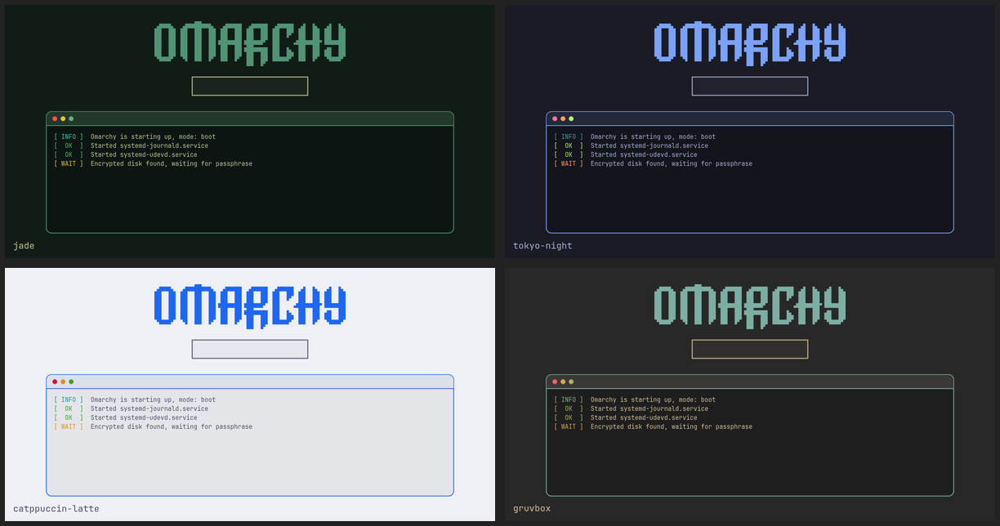

# Omarchy Terminal Splash

A boot splash for [Omarchy](https://omarchy.org) that keeps the normal Omarchy logo and disk-unlock box, and adds a terminal-style panel underneath where you can watch the boot happen live.



- The log shows real events: the encrypted disk waiting for its passphrase, the disk being unlocked, and every systemd service as it starts (`[  OK  ] Started NetworkManager.service`). On shutdown it lists the services being stopped.
- It follows your current Omarchy theme: background, panel, border, status colours, logo tint and font all come from the active theme's `colors.toml` and font when you install. The panel sits below the password box so the two never overlap.
- It's a copy of the Omarchy Plymouth theme with the terminal added on top, so the unlock prompt works exactly as before.

## Install

```bash
git clone https://github.com/davidcrickett/omarchy-terminal-splash
cd omarchy-terminal-splash
./preview.sh   # optional: try it in a window without touching your boot
./install.sh   # builds it in your current theme's colours, installs it and rebuilds the boot image
```

Reboot to see it. `install.sh` and `revert.sh` ask for your sudo password because they change the boot image.

## Follow theme changes automatically (optional)

```bash
./auto-update.sh        # turn it on
./auto-update.sh --off  # turn it off
```

This adds a small Omarchy hook (`~/.config/omarchy/hooks/theme-set.d/terminal-splash`). After that, whenever you switch themes, an Omarchy terminal pops up, asks for your sudo password, and rebuilds the splash in the new colours. The password is asked for in plain sight, the same as running `./install.sh` yourself, and nothing is stored. Leave the folder where it is, since the hook runs `install.sh` from there. It's off unless you turn it on.

## Go back to the normal splash

```bash
./revert.sh
```

If an Omarchy update resets the boot splash, just run `./install.sh` again.

## Notes

- Tested on Omarchy with Limine, an encrypted btrfs root and an NVIDIA RTX 4070.
- On a fast machine the services fly by in a couple of seconds, which is part of the fun.
- The preview may not open a window under some Wayland setups. That doesn't affect the real boot.
- Switched themes? Run `./install.sh` again (or turn on `./auto-update.sh`) and the splash will match the new one. Colours a theme doesn't define fall back to Osaka Jade's. Needs ImageMagick (`magick`), which Omarchy ships with.

## Credits

Based on the Plymouth theme from [Omarchy](https://github.com/omacom/omarchy) (MIT licence), with its logo, lock and password images reused and tinted the same way Omarchy tints them.
